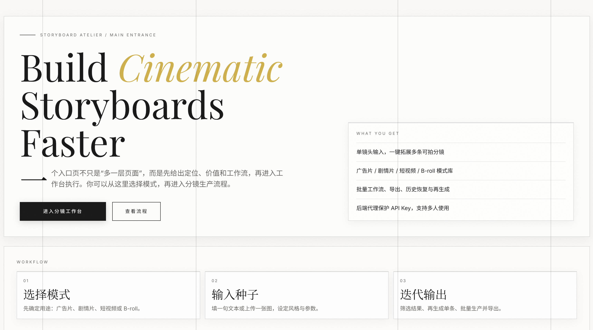
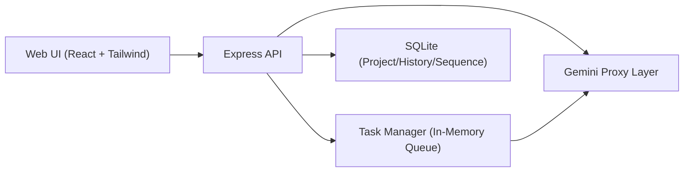

# Frameflow Studio

<p align="center">
  <a href="https://github.com/Duang777/frameflow-studio/blob/main/LICENSE"></a>
  <a href="https://github.com/Duang777/frameflow-studio/actions/workflows/ci.yml"></a>
  
</p>

<p align="center">
  From one seed idea to production-ready storyboards, visuals, and sequence videos.
</p>

<p align="center">
  <strong>Value Proposition:</strong> turn abstract ideas into camera-ready storyboard pipelines with reliable iteration.
</p>

<table align="center">
  <tr>
    <td align="center"><strong>6 / 8 / 10</strong><br/>Configurable shot expansion</td>
    <td align="center"><strong>4 Tabs</strong><br/>Workflow Hub for daily operations</td>
    <td align="center"><strong>SQLite</strong><br/>Project-scoped persistence & replay</td>
  </tr>
</table>

<p align="center">
  <a href="README.md">中文</a> | English
</p>

<p align="center">
  <a href="#quick-start">Quick Start</a> · <a href="#demo">Demo</a> · <a href="#roadmap">Roadmap</a> · <a href="#troubleshooting">Troubleshooting</a>
</p>

---

## Overview

**Frameflow Studio** is an editorial-grade storyboard workspace for directors, writers, ad creatives, and short-form video teams.

It focuses on an end-to-end pipeline instead of one-shot text generation:

- Expand text/image seeds into structured, shootable shots
- Continue production with image, video, and sequence composition
- Keep workflows stable with project/chapter organization, queueing, and history replay

### Who is this for

- Directors and writers who need to turn abstract ideas into camera-ready shots fast.  
- Brand and ad teams that need repeatable pre-visualization and pitch pipelines.  
- AI-native creators who need generation + management + replay in one place.

---

## Demo

<table>
  <tr>
    <td width="50%">
      <strong>Main Entrance</strong><br/>
      A clear first step for positioning, value, and workflow entry.
      <br/><br/>
      
    </td>
    <td width="50%">
      <strong>Studio Workspace</strong><br/>
      Unified production surface for input, expansion, generation, queue, and history.
      <br/><br/>
      
    </td>
  </tr>
</table>

---

## Key Features

- Storyboard expansion with configurable shot count (`6/8/10`)
- Preset mode library (Ad / Drama / Short Video / B-roll)
- Shot-level remix and rapid iteration
- Per-shot image/video generation with retry
- Sequence Video Composer:
  - reorder/remove/restore original order
  - reference image policy `all | keyframes | first_last | text_only`
  - config summary, replay, and retry from history
- Workflow Hub modal: `Batch / Queue / History / Advanced`
- URL state memory for queue filter and hub tab
- Project-scoped persistence for sequence history (`sequence_videos`)

---

## Architecture

- Frontend: React 19 + Vite + Tailwind CSS
- Backend: Node.js + Express (API proxy for model requests)
- Storage: SQLite (`server/data/storyboard.sqlite`)

Core tables: `projects`, `chapters`, `shots`, `shot_images`, `shot_videos`, `sequence_videos`, `history_entries`

### Architecture Diagram (Simplified)



### Feature Matrix

| Capability | Status | Notes |
|---|---|---|
| Storyboard expansion (single) | ✅ | Text/image input with 6/8/10 outputs |
| Storyboard expansion (batch) | ✅ | Batch workflow + queue tracking |
| Per-shot image generation | ✅ | Retry supported, persisted per chapter |
| Per-shot video generation | ✅ | Retry supported, persisted per chapter |
| Multi-shot sequence video | ✅ | Ordered chain with reference-image policies |
| Sequence video replay/history | ✅ | SQLite persistence by project/chapter |
| Workflow Hub URL memory | ✅ | Preserves queue filter + active tab |
| Redis-backed queue | ⏳ | Planned for a later reliability milestone |

---

## Quick Start

### 1) Install

```bash
npm install
```

### 2) Configure env

```bash
cp .env.example .env
```

Windows PowerShell:

```powershell
Copy-Item .env.example .env
```

Minimal setup:

```env
GEMINI_API_KEY=your_api_key
```

Recommended setup:

```env
GEMINI_TEXT_MODEL=gemini-2.5-flash-image
GEMINI_IMAGE_MODEL=gemini-3.1-flash-image-preview
GEMINI_VIDEO_MODEL=gemini-2.5-flash-image
GEMINI_IMAGE_TIMEOUT_MS=90000
GEMINI_VIDEO_TIMEOUT_MS=90000
GEMINI_VIDEO_POLL_INTERVAL_MS=2500
GEMINI_VIDEO_MAX_WAIT_MS=300000
```

### 3) Start dev

```bash
npm run dev
```

Default URLs:
- Frontend: `http://localhost:5173`
- Backend: `http://localhost:8787`
- Studio: `http://localhost:5173/studio`

### 4) Health check

Open `http://localhost:8787/api/health`

---

## API Summary

### Core Endpoints

| Method | Endpoint | Purpose |
|---|---|---|
| GET | `/api/health` | Service health |
| GET | `/api/modes` | Storyboard mode presets |
| GET | `/api/workspace/bootstrap` | Bootstrap project/chapter context |

### Project & Chapter

| Method | Endpoint | Purpose |
|---|---|---|
| GET | `/api/projects` | List projects |
| POST | `/api/projects` | Create project |
| PATCH | `/api/projects/:projectId` | Update project |
| DELETE | `/api/projects/:projectId` | Delete project (with guard) |
| GET | `/api/projects/:projectId/chapters` | List chapters |
| POST | `/api/projects/:projectId/chapters` | Create chapter |
| PATCH | `/api/projects/:projectId/chapters/:chapterId` | Update chapter |
| DELETE | `/api/projects/:projectId/chapters/:chapterId` | Delete chapter (with guard) |

### Shots & Media

| Method | Endpoint | Purpose |
|---|---|---|
| GET | `/api/projects/:projectId/chapters/:chapterId/shots` | Get chapter shots |
| PUT | `/api/projects/:projectId/chapters/:chapterId/shots` | Replace chapter shots |
| PATCH | `/api/projects/:projectId/chapters/:chapterId/shots/:shotIndex/image` | Update shot image |
| PATCH | `/api/projects/:projectId/chapters/:chapterId/shots/:shotIndex/video` | Update shot video |

### Sequence Video History

| Method | Endpoint | Purpose |
|---|---|---|
| GET | `/api/projects/:projectId/chapters/:chapterId/sequence-videos` | List sequence history |
| POST | `/api/projects/:projectId/chapters/:chapterId/sequence-videos` | Upsert sequence history |
| DELETE | `/api/projects/:projectId/chapters/:chapterId/sequence-videos/:id` | Remove history item |

### Async Task Queue

| Method | Endpoint | Purpose |
|---|---|---|
| POST | `/api/tasks/expand` | Create expansion task |
| POST | `/api/tasks/batch-expand` | Create batch expansion task |
| POST | `/api/tasks/generate-image` | Create shot image task |
| POST | `/api/tasks/generate-video` | Create video task (single/sequence) |
| GET | `/api/tasks/:taskId` | Poll task status |
| POST | `/api/tasks/:taskId/cancel` | Cancel task |

`GET /api/tasks/:taskId` includes optional enhanced fields in `task`: `stageCode`, `summary`, and `retryable` (backward compatible).

---

## Roadmap

- Redis-backed queue for multi-instance reliability
- Team collaboration and permission model
- Object storage for generated media assets
- Richer shot grammar and reusable prompt packs

---

## Troubleshooting

- **Tasks stay queued forever**  
  Open `http://localhost:8787/api/health` and verify `hasApiKey=true` and backend availability.
- **Auth/model errors during generation**  
  Re-check `.env` values for `GEMINI_API_KEY`, model names, and endpoint templates.
- **Cursor/proxy network failure**  
  See [proxy troubleshooting guide](docs/cursor-proxy-troubleshooting.md).

---

## License

MIT License. See [LICENSE](LICENSE).
